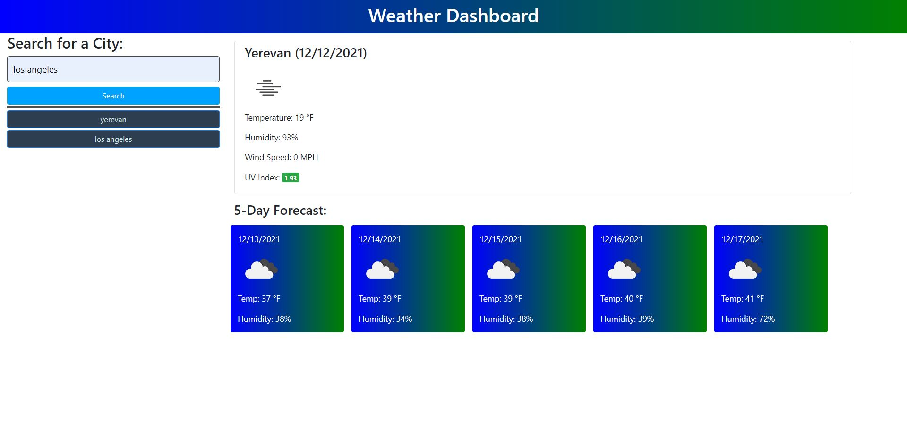

# Server-Side APIs Challenge: Weather Dashboard

## Description

This project is an application that user can use to search city by name and see weather outlook.
By clicking search button user can search weather and save sity by name showen on page by button.  

## Tasks completed

* Was structured git hub repository with deployed result web page.
* Was constructed web page by mock-up and project solved by using tird party free for using API caled Open Weather https://openweathermap.org/api. 
* Was aded functionality to web page by accepted citeria.

## Links

* deployed website https://am0726github.github.io/SSAPIsChallenge/

* Code repository https://github.com/AM0726Github/SSAPIsChallenge

## Screenshot of Web page

## References and tutorials utilized

* https://stackoverflow.com
* https://www.w3schools.com/js
* https://api.jquery.com/category/css/
* https://getbootstrap.com/
* https://developer.mozilla.org/
* https://alligator.io/js/push-pop-shift-unshift-array-methods/
* https://learn.jquery.com/using-jquery-core/document-ready/
